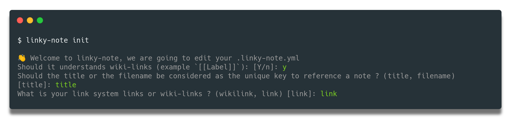

# linky-note

<div align="center">

[](https://github.com/jb-delafosse/linky-note/actions?query=workflow%3Abuild)
[](https://pypi.org/project/linky-note/)
[](https://github.com/jb-delafosse/linky-note/pulls?utf8=%E2%9C%93&q=is%3Apr%20author%3Aapp%2Fdependabot)

[](https://github.com/psf/black)
[](https://github.com/PyCQA/bandit)
[](https://github.com/jb-delafosse/linky-note/blob/master/.pre-commit-config.yaml)
[](https://github.com/jb-delafosse/linky-note/releases)
[](https://github.com/jb-delafosse/linky-note/blob/master/LICENSE)

</div>

## 🤔 Description

This project provide a markdown to markdown converter that adds a [Bi-Directional Link](https://maggieappleton.com/bidirectionals)
Section at the end of each markdown files that is converted. It is heavily inspired by the [note-link-janitor](https://github.com/andymatuschak/note-link-janitor) 

The project also provide a [pre-commit hook](https://pre-commit.com/) so you can easily integrate it within your own projects easily

It relies heavily on the [Marko](https://github.com/frostming/marko/tree/master/marko) python package that is the only 
Markdown Parser with a Markdown Renderer that I know of.

## 💭 Why

I believe a great amount of information can be extracted from collaborative notes if we take time to structure them correctly.

I wanted:
- To make collaborative notes
- To organize the notes in a [Roam](https://roamresearch.com/) like manner
- Everyone to be able to navigate through the notes without installing anything
- This system to be easily adopted by a software engineering team.

Using git and this converter as a pre-commit, I can easily do all of this ! 🚀

## ✨ Features

- Understands both  Wikilinks and Markdown links
- Can use a reference system based on Title as unique Keys or filename as unique key
- Can convert wikilinks to markdown links and reciprocally   
- All this, entirely configurable through a simple stepper using `linky-note init` command




## 🏃 Getting Started
<details>
  <summary>Installation as a python package with pip</summary>

Considering you already have python available. You can simply add th

```bash
pip install --user linky_note
```

Then you can see all the option of the CLI using

```bash
linky_note --help
```

It is advised to start by configuring the CLI using

```bash
linky_note init

```
You can then apply the conversion 

```bash
linky_note apply <INPUT_DIR> --output-dir <OUTPUT_DIR> 

```

If no `OUTPUT_DIR` is given, it will overwrite the files in `INPUT_DIR`

</details>

<details>
  <summary>Installation as a pre-commit hook</summary>
This pre-commit hook use the [pre-commit](https://pre-commit.com) tool that you will
need to install.

Add the following line to your pre-commit configuration (`.pre-commit-config.yaml`) at the root of your 
repository.

```yaml
repos:
-   repo: https://github.com/jb-delafosse/linky_note
    rev: v0.4.1
    hooks:
      - id: linky_note apply
        args: ['directory-containing-my-markdown']
```
and install the hook using `pre-commit install`


You should also run `linky init` at the root of your repo to configure linky-note

</details>

## 🛡 License

[](https://github.com/jb-delafosse/linky-note/blob/master/LICENSE)

This project is licensed under the terms of the `MIT` license. See [LICENSE](https://github.com/jb-delafosse/linky-note/blob/master/LICENSE) for more details.

## 📃 Citation

```
@misc{linkynote,
  author = {jb-delafosse},
  title = {Awesome `linkynote` is a Python cli/package created with https://github.com/TezRomacH/python-package-template},
  year = {2020},
  publisher = {GitHub},
  journal = {GitHub repository},
  howpublished = {\url{https://github.com/jb-delafosse/linkynote}}
}
```

## Credits

This project was generated with [`python-package-template`](https://github.com/TezRomacH/python-package-template).
It is heavily inspired by the [note-link-janitor](https://github.com/andymatuschak/note-link-janitor)
